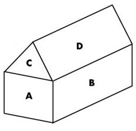

## Crea un proyecto nuevo en el que realizar los siguientes ejercicios. (cada uno de los ejercicios se escribirá en un archivo php distinto)

#### **·ejercicio1**: Escribe un programa que utilizando una enumeración, muestre por pantalla los palos de la baraja española. La salida del programa debe ser similar a:
```
PALOS DE LA BARAJA ESPAÑOLA
---------------------------
Palo 1: OROS
Palo 2: COPAS
Palo 3: BASTOS
Palo 4: ESPADAS
```
#### **ejercicio2**: Escribe un programa que pida al usuario dos números reales (double) y devuelva por pantalla el doble del primero, la mitad del segundo, el cuadrado de la suma, la décima parte de la suma de sus cuadrados.
```
CÁLCULOS ARITMÉTICOS
--------------------
Se van a realizar una serie de operaciones con dos números reales
Introduce el primer número: 2
Introduce el segundo número: 5

RESULTADO
---------
Doble del primer número: 4.0
Mitad del segundo número: 2.5
Cuadrado de la suma de ambos número: 49.0
Décima parte de la suma de los cuadrados de ámbos números: 2.9
```
#### **ejercicio3**: Escribe un programa que pida un número y muestre por pantalla si el número es cero, positivo, menor que 100 o par.
```
Análisis de un número
---------------------
Introduce un número entero : 31

RESULTADO
---------
El número es cero: false
El número es positivo: true
El número es menos que 100: true
El número es par: false
```
#### **ejercicio4**: En un almacén de bombillas, las estanterías tienen una capacidad de 40 unidades cada una. Escribe un programa que pida al usuario un número de bombillas e indique cuantas estanterías se necesitan para almacenarlas. También debe indicar el número de huecos libres de la última estantería. La salida del programa sería:
```
ESTANTERÍAS Y BOMBILLAS
-----------------------
Inotrudzca la cantidad de bombillas que se deasean colocar: 116

RESULTADO
---------
Cantidad de estanterías completas: 2
Cantidad de huecos libres en la última estantería no completa: 4
```
#### **ejercicio5**: Queremos fabricar una casa de madera utilizando paneles como los de la figura.


#### Escribe un programa que tomando las longitudes de ancho y largo (en metros) nos indique los tamaños en metros cuadrados de las paneles necesarios para su construcción.
```
METROS CUADRADOS DEL EXTERIOR DE UNA CASA
-----------------------------------------
Introduzca la longitud del lado largo de la figura (en metros): 12
Introduzca la longitud del lado corto de la figura (en metros): 8

RESULTADO
---------
Metros cuadrados de los paneles de tipo A: 64.0
Metros cuadrados de los paneles de tipo B: 96.0
Metros cuadrados de los paneles de tipo C: 27.712812921102035
Metros cuadrados de los paneles de tipo D: 96.0

Superficie total del exterior de la casa: 567.425625842204 metros cuadrados totales
```

#### ejercicio6: Queremos revisar el reparto de fruta de un camión. El camión se carga en la frutería y realiza 3 paradas. El usuario indica la carga inicial y la descarga en cada una de las paradas (cantidades enteras). El programa indicará al final si se repartió toda la fruta o si quedó parte de la carga sin repartir. Un ejemplo de la salida del programa podría ser:
```
REPARTO DE FRUTA
----------------
Introduzca los kilogramos totales con los que cargar el camión: 95
Primera parada del camión para repartir.
Introduzca los kilogramos totales que debe repartir en esta primera parada: 22
El camión reparte 22.0 y quedan por tanto po repartir 73.0 kgs.

Segunda parada del camión para repartir.
Introduzca los kilogramos totales que debe repartir en esta segunda parada: 38
El camión reparte: 38.0  y quedan por tanto por repartir 35.0 kgs.

Tercera parada del camión para repartir.
Introduzca los kilogramos totales que debe repartir en esta tercera parada: 30
El camión reparte: 30.0 y quedan por tanto por repartir 5.0 kgs.

RESULTADO
---------
Quedó algo por repartir
```
